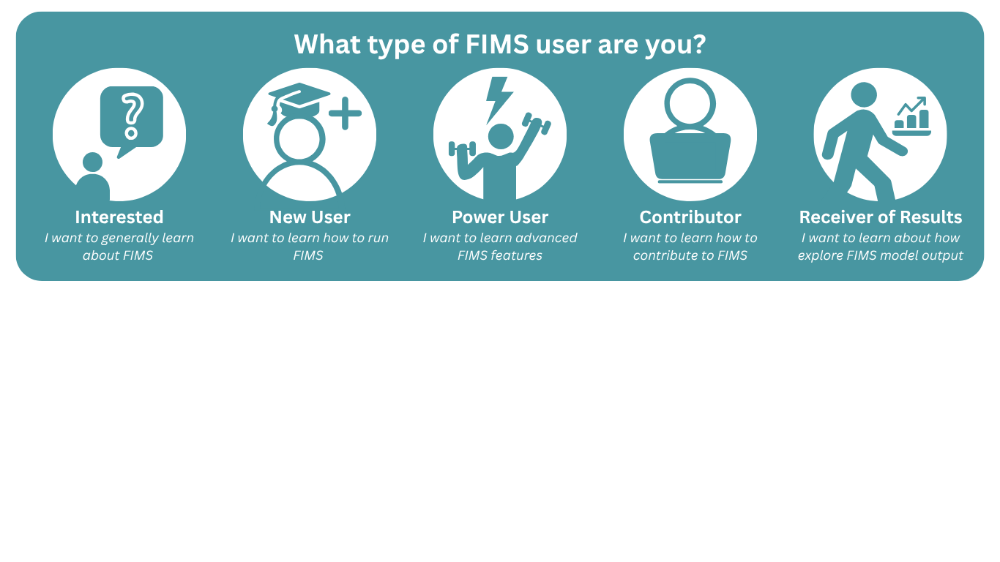

```{=html}
<div class="site-hero mb-5">
  <div class="site-intro">
    <h1 class="site-title text-primary mt-0 fw-lighter text-center text-sm-start">
      NOAA Fisheries Integrated Modeling System
    </h1>

    <div class="social-icon-links my-3" aria-hidden="true">
      <a
        class="link-primary"
        href="https://github.com/NOAA-FIMS"
        title="FIMS on GitHub"
        aria-label="Visit FIMS on GitHub"
        target="_blank"
        rel="noopener"
      >
        <i class="fab fa-github fa-lg fa-fw"></i>
      </a>

      <a
        class="link-primary"
        href="https://noaa-fims.r-universe.dev"
        title="FIMS R Universe"
        aria-label="Visit FIMS R Universe repository"
        target="_blank"
        rel="noopener"
      >
        <i class="fab fa-r-project fa-lg fa-fw"></i>
      </a>

      <a
        class="link-primary"
        href="https://nmfs-ost.github.io/noaa-fit/"
        title="NOAA Fisheries Integrated Toolbox"
        aria-label="Visit NOAA Fisheries Integrated Toolbox"
        target="_blank"
        rel="noopener"
      >
        <i class="fa fa-briefcase fa-lg fa-fw"></i>
      </a>
    </div>

    <p class="site-intro fs-5">
      Welcome to the <strong>Fisheries Integrated Modeling System (FIMS)</strong> community playbook, your source of information for all members of the FIMS community--developers, users, and receivers of stock assessments. We welcome both those that are new and seasoned to the field to join us as we work to fulfill our <a href="about/index.qmd#mission">mission</a>!
    </p>
    <a class="mt4 action text" href="about/index.qmd">See the <strong>overview page</strong> for more! →</a>
  </div>

  <div class="site-logo">
    
  </div>
</div>
```

## FIMS User Pathways

```{=html}
<div class="fims-graphic-container">
  

  <button class="hotspot" id="hs-user1" onclick="changeImage('images/fims-user1.png', 'Pathway for Interested')" aria-label="Show pathway for Interested"></button>
  <button class="hotspot" id="hs-user2" onclick="changeImage('images/fims-user2.png', 'Pathway for New User')" aria-label="Show pathway for New User"></button>
  <button class="hotspot" id="hs-user3" onclick="changeImage('images/fims-user3.png', 'Pathway for Power User')" aria-label="Show pathway for Power User"></button>
  <button class="hotspot" id="hs-user4" onclick="changeImage('images/fims-user4.png', 'Pathway for Contributor')" aria-label="Show pathway for Contributor"></button>
  <button class="hotspot" id="hs-user5" onclick="changeImage('images/fims-user5.png', 'Pathway for Receiver of Results')" aria-label="Show pathway for Receiver of Results"></button>

  <a href="https://noaa-fims.github.io/about/faq.html" class="hotspot link-hotspot" id="link-faq-interested" data-show-on="user1" target="_blank" aria-label="Go to FAQ page"></a>
  <a href="https://github.com/NOAA-FIMS/FIMS/milestones?sort=due_date&direction=asc" class="hotspot link-hotspot" id="link-planning-interested" data-show-on="user1" target="_blank" aria-label="Go to FIMS Project Milestones"></a>
  <a href="https://github.com/orgs/NOAA-FIMS/discussions/801" class="hotspot link-hotspot" id="link-intro-gh-interested" data-show-on="user1" target="_blank" aria-label="Go to Introductions github discussion"></a>
  <a href="https://noaa-fims.github.io/about/calendar.html" class="hotspot link-hotspot" id="link-calendar-interested" data-show-on="user1" target="_blank" aria-label="Go to FIMS calendar"></a>
  <a href="https://noaa-fims.github.io/blog/" class="hotspot link-hotspot" id="link-blog-interested" data-show-on="user1" target="_blank" aria-label="Go to FIMS blog"></a>

  <a href="https://github.com/orgs/NOAA-FIMS/discussions/801" class="hotspot link-hotspot" id="link-intro-gh-newuser" data-show-on="user2" target="_blank" aria-label="Go to Introductions github discussion"></a>
  <a href="https://noaa-fims.github.io/FIMS/articles/fims-demo.html" class="hotspot link-hotspot" id="link-intro-demo-newuser" data-show-on="user2" target="_blank" aria-label="Go to fims introductory vignette"></a>
  <a href="https://noaa-fims.github.io/resources/packages.html" class="hotspot link-hotspot" id="link-fims-packages-newuser" data-show-on="user2" target="_blank" aria-label="Go to fims-related packages page"></a>
  <a href="https://noaa-fims.github.io/blog/" class="hotspot link-hotspot" id="link-blog-newuser" data-show-on="user2" target="_blank" aria-label="Go to FIMS blog"></a>
  <a href="https://noaa-fims.github.io/about/calendar.html" class="hotspot link-hotspot" id="link-calendar-newuser" data-show-on="user2" target="_blank" aria-label="Go to FIMS calendar"></a>

  <a href="https://noaa-fims.github.io/FIMS/articles/fims-logging.html" class="hotspot link-hotspot" id="link-advanced-vignettes-poweruser" data-show-on="user3" target="_blank" aria-label="Go to advanced user vignettes"></a>
  <a href="https://github.com/orgs/NOAA-FIMS/discussions/" class="hotspot link-hotspot" id="link-gh-discussions-poweruser" data-show-on="user3" target="_blank" aria-label="Go to FIMS github discussions"></a>
  <a href="https://noaa-fims.github.io/resources/packages.html" class="hotspot link-hotspot" id="link-fims-packages-poweruser" data-show-on="user3" target="_blank" aria-label="Go to fims-related packages page"></a>
  <a href="https://noaa-fims.github.io/about/calendar.html" class="hotspot link-hotspot" id="link-calendar-poweruser" data-show-on="user3" target="_blank" aria-label="Go to FIMS calendar"></a>
  <a href="https://noaa-fims.github.io/blog/" class="hotspot link-hotspot" id="link-blog-poweruser" data-show-on="user3" target="_blank" aria-label="Go to FIMS blog"></a>

  <a href="https://noaa-fims.github.io/FIMS/articles/fims-path-maturity.html" class="hotspot link-hotspot" id="link-contributor-vignettes-contributor" data-show-on="user4" target="_blank" aria-label="Go to developer vignettes"></a>
  <a href="https://github.com/NOAA-FIMS/FIMS/milestones?sort=due_date&direction=asc" class="hotspot link-hotspot" id="link-planning-contributor" data-show-on="user4" target="_blank" aria-label="Go to FIMS Project Milestones"></a>
  <a href="https://github.com/orgs/NOAA-FIMS/discussions/" class="hotspot link-hotspot" id="link-gh-discussions-contributor" data-show-on="user4" target="_blank" aria-label="Go to FIMS github discussions"></a>
  <a href="https://noaa-fims.github.io/about/calendar.html" class="hotspot link-hotspot" id="link-calendar-contributor" data-show-on="user4" target="_blank" aria-label="Go to FIMS calendar"></a>
  <a href="https://noaa-fims.github.io/blog/" class="hotspot link-hotspot" id="link-blog-contributor" data-show-on="user4" target="_blank" aria-label="Go to FIMS blog"></a>

  <a href="https://noaa-fims.github.io/about/faq.html" class="hotspot link-hotspot" id="link-faq-receiver" data-show-on="user5" target="_blank" aria-label="Go to FAQ page"></a>
  <a href="https://github.com/NOAA-FIMS/FIMS/milestones?sort=due_date&direction=asc" class="hotspot link-hotspot" id="link-planning-receiver" data-show-on="user5" target="_blank" aria-label="Go to FIMS Project Milestones"></a>
  <a href="https://github.com/orgs/NOAA-FIMS/discussions/801" class="hotspot link-hotspot" id="link-intro-gh-receiver" data-show-on="user5" target="_blank" aria-label="Go to Introductions github discussion"></a>
  <a href="https://noaa-fims.github.io/blog/" class="hotspot link-hotspot" id="link-blog-receiver" data-show-on="user5" target="_blank" aria-label="Go to FIMS blog"></a>
</div>
```
